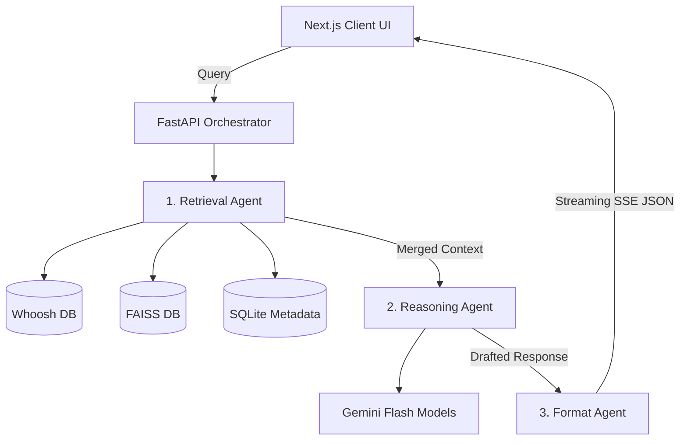

<div align="center">
  

  # ⚖️ NyayaMitra (Legal AI Platform)
  
  **India's Smartest Legal Research Engine**

  <p align="center">
    <a href="#features">Features</a> • 
    <a href="#architecture">Architecture</a> • 
    <a href="#getting-started">Getting Started</a> • 
    <a href="#roadmap">Roadmap</a>
  </p>
  
  [](https://opensource.org/licenses/MIT)
  [](https://nextjs.org/)
  [](https://fastapi.tiangolo.com/)
  [](https://python.org)

</div>

---

## ⚡ Features

- 🔍 **Hybrid Retrieval Engine**: Combines **BM25 Keyword Search** (via Whoosh) & **Semantic Vector Search** (via FAISS) integrated using Reciprocal Rank Fusion (RRF) for ultimate accuracy.
- 🤖 **3-Agent AI Architecture**:
  1. **Retriever Agent:** Finds exact, context-dense case laws.
  2. **Reasoner Agent:** Extracts insights and builds a rigorous, hallucination-free answer.
  3. **UI/Formatting Agent:** Formats the output seamlessly with embedded hoverable citations.
- 📌 **Zero Hallucination Guarantee**: Every single legally significant claim is backed by a verifiable paragraph citation from an actual court document.
- 🗂️ **Advanced Case Filtering**: Sort and filter judgments smoothly by Court, Case Type, Date, and Relevance.
- 🎨 **Modern, Premium UI**: Pastel SaaS-based design scheme built strictly keeping the UX of researchers, lawyers, and legal interns in mind, engineered with responsive React & Next.js.

---

## 📐 Architecture

NyayaMitra separates its concerns rigidly between the frontend presentation layer and a heavy-duty backend Python orchestration system.



---

## 🚀 Getting Started

To run NyayaMitra locally, ensure you have **Node.js 18+** and **Python 3.10+** installed on your system.

### 1. Clone the repository
```bash
git clone https://github.com/Ayushk212/NyayaMitra.git
cd NyayaMitra
```

### 2. Backend Setup (FastAPI)
```bash
cd backend
python -m venv .venv

# Activate the virtual environment
# Windows:
.venv\Scripts\activate
# Mac/Linux:
source .venv/bin/activate

# Install dependencies
pip install -r requirements.txt

# Run the API server
python -m uvicorn app.main:app --reload
```
> **Note**: Don't forget to create a `.env` in the `backend/` directory with `GEMINI_API_KEY=your_key_here` if you plan to process real AI queries and build indexes!

### 3. Frontend Setup (Next.js)
Open a new terminal window:
```bash
cd frontend
npm install

# Start the dev server
npm run dev
```

Visit `http://localhost:3000` to interact with the platform.

---

## 🧠 Index Building (Optional)

If you are modifying the raw JSON dataset of case laws (`backend/data/seed_cases.json`), you'll need to rebuild the internal BM25 maps and FAISS embeddings:
```bash
cd backend
python -m scripts.build_index
```
Ensure you have set the `GEMINI_API_KEY` to run the embedding generator.

---

## 🤝 Contributing

Contributions, issues, and feature requests are welcome!
Feel free to check [issues page](https://github.com/Ayushk212/NyayaMitra/issues).

## 📄 License

Distributed under the MIT License. See `LICENSE` for more information.
